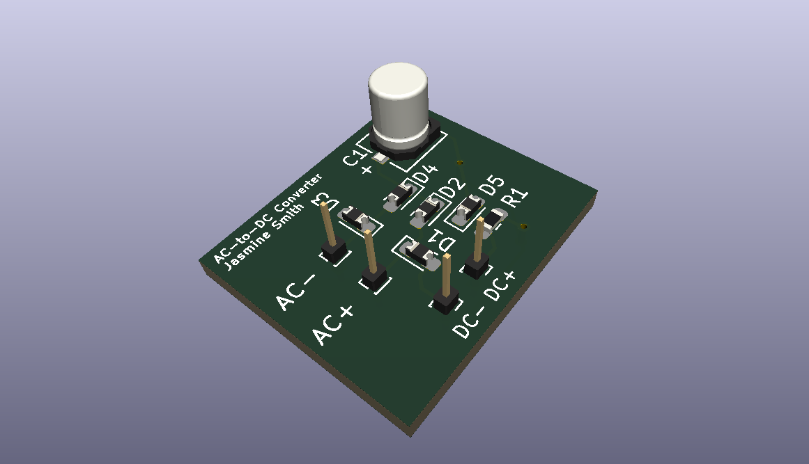

# AC-to-DC-converter (2023)
## SIMULATION
The simulation was completed as part of a microelectronics lab.\
The circuit was then implemented on a breadboard\
An oscilloscope and waveform generator were used to test the function of the AC to DC Converter

## PCB
I created this AC-to-DC PCB as one of my first PCB projects.\
The purpose was to learn the basics of KiCAD and PCB design.\
### Schematic

### BOM
### Stackup
### Layout

### 3D Preview
Click the preview image to view the 3D PCB 
