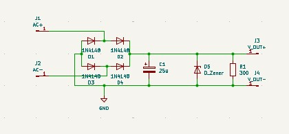

# AC-to-DC-converter (2023)
## SIMULATION
The simulation was completed as part of a microelectronics lab.\
The circuit was then implemented on a breadboard\
An oscilloscope and waveform generator were used to test the function of the AC to DC Converter

## PCB
I created this AC-to-DC PCB as one of my first PCB projects.\
The purpose was to learn the basics of KiCAD and PCB design.
### Schematic

### BOM
| Id | Designator     | Footprint                                   | Quantity | Designation | Supplier and ref |
|----|----------------|---------------------------------------------|----------|-------------|------------------|
| 1  | C1             | PCAP_4x5.4-ELECT_NCA                        | 1        | 25u         |                  |
| 2  | D1, D2, D3, D4 | D_0603_1608Metric_Pad1.05x0.95mm_HandSolder | 4        | 1N4148      |                  |
| 3  | D5             | D_0603_1608Metric_Pad1.05x0.95mm_HandSolder | 1        | D_Zener     |                  |
| 4  | J1             | PinHeader_1x01_P1.00mm_Vertical             | 1        | AC+         |                  |
| 5  | J2             | PinHeader_1x01_P1.00mm_Vertical             | 1        | AC-         |                  |
| 6  | J3             | PinHeader_1x01_P1.00mm_Vertical             | 1        | DC+         |                  |
| 7  | J4             | PinHeader_1x01_P1.00mm_Vertical             | 1        | DC-         |                  |
| 8  | R1             | R_0603_1608Metric_Pad0.98x0.95mm_HandSolder | 1        | 300         |                  |
### Stackup
### Layout

### 3D Preview
Click the preview image to view the 3D PCB 
